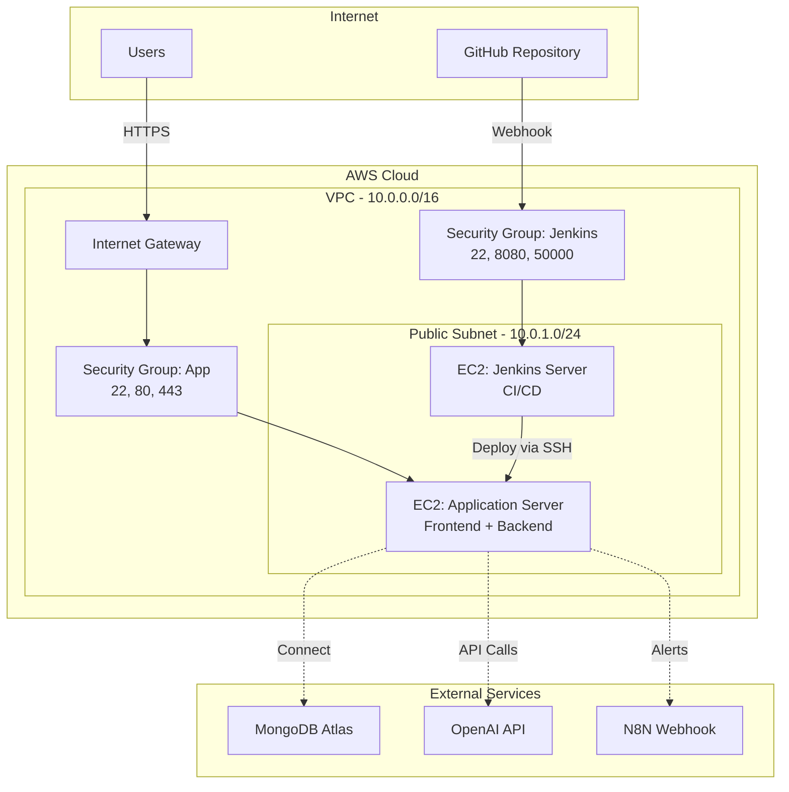

# Kế Hoạch Triển Khai LogAnalyzer trên AWS với Infrastructure as Code

> **Mục tiêu**: Triển khai LogAnalyzer lên AWS EC2 với Terraform, Ansible, Jenkins CI/CD, và Nginx SSL - phù hợp cho intern DevOps

---

## 1. TỔNG QUAN DỰ ÁN

### 1.1. Giới Thiệu
Nâng cấp dự án **LogAnalyzer** từ môi trường local lên **AWS Cloud** với Infrastructure as Code, tương tự project Hotel Management trong CV mẫu.

### 1.2. Ứng Dụng Hiện Tại
- **Frontend**: React 19 + Vite + PrimeReact + Tailwind CSS
- **Backend**: Flask (Python) + MongoDB Atlas + OpenAI API
- **Hiện tại**: Chạy local hoặc Docker Compose
- **Domain**: https://loganalyzer.dofuta.site/

### 1.3. Mục Tiêu Nâng Cấp
✅ **Infrastructure as Code** với Terraform  
✅ **Automation** với Ansible  
✅ **CI/CD Pipeline** với Jenkins  
✅ **Production-ready** với Nginx + SSL  
✅ **Containerization** với Docker  
✅ **Version Control** với Git/GitHub  

### 1.4. Điểm Khác Biệt So Với Kubernetes
| Aspect | AWS IaC (Project 2) | Kubernetes (Project 1) |
|--------|---------------------|------------------------|
| **Complexity** | ⭐⭐⭐ (Intern-friendly) | ⭐⭐⭐⭐⭐ (Advanced) |
| **Infrastructure** | EC2 VMs | Kubernetes Cluster |
| **Orchestration** | Docker Compose | K8s + ArgoCD |
| **Learning Curve** | Moderate | Steep |
| **Cost** | $20-50/month | $100-300/month |
| **Setup Time** | 1-2 weeks | 4-6 weeks |

---

## 2. KIẾN TRÚC HỆ THỐNG

### 2.1. AWS Architecture Diagram



### 2.2. Tech Stack

#### Infrastructure Layer
- **Terraform**: IaC để provision AWS resources
- **Ansible**: Configuration management và automation
- **AWS EC2**: Virtual machines (t3.medium hoặc t3.small)
- **AWS VPC**: Network isolation
- **AWS Security Groups**: Firewall rules

#### CI/CD Layer
- **Jenkins**: Automation server cho build và deploy
- **Docker Hub**: Container registry
- **GitHub**: Source code repository
- **Webhooks**: Auto-trigger CI/CD

#### Application Layer
- **Docker**: Containerization
- **Nginx**: Web server + reverse proxy
- **Certbot**: SSL certificate automation (Let's Encrypt)
- **React + Flask**: Application stack

---

## 3. REPOSITORY STRUCTURE

Tạo 3 repositories riêng biệt (giống CV mẫu):

```
1. LogAnalyzer (Application Code)
   ├── frontend/
   ├── backend/
   ├── docker-compose.yml
   ├── Jenkinsfile
   └── README.md

2. LogAnalyzer-Frontend (Optional: separate repo)
   ├── src/
   ├── Dockerfile
   └── nginx.conf

3. LogAnalyzer-Infrastructure (IaC)
   ├── terraform/
   │   ├── main.tf
   │   ├── variables.tf
   │   ├── outputs.tf
   │   ├── vpc.tf
   │   ├── ec2.tf
   │   └── security-groups.tf
   ├── ansible/
   │   ├── inventory/
   │   │   └── hosts.yml
   │   ├── playbooks/
   │   │   ├── setup-jenkins.yml
   │   │   ├── setup-application.yml
   │   │   └── install-docker.yml
   │   └── roles/
   │       ├── docker/
   │       ├── jenkins/
   │       └── nginx/
   └── README.md
```

---

## 4. TRIỂN KHAI TỪNG BƯỚC

### PHASE 1: Chuẩn Bị Môi Trường (1-2 ngày)

#### Bước 1.1: Cài Đặt Tools Cần Thiết

**Trên máy local**:
```powershell
# 1. Install Terraform
choco install terraform

# 2. Install AWS CLI
choco install awscli

# 3. Install Ansible
pip install ansible

# 4. Verify installations
terraform version
aws --version
ansible --version
```

#### Bước 1.2: Cấu Hình AWS Credentials

```powershell
# Configure AWS CLI
aws configure
# AWS Access Key ID: <your-key>
# AWS Secret Access Key: <your-secret>
# Default region: us-east-1 (hoặc ap-southeast-1 cho Singapore)
# Default output format: json

# Test connection
aws sts get-caller-identity
```

#### Bước 1.3: Tạo SSH Key Pair

```powershell
# Generate SSH key for EC2 access
ssh-keygen -t rsa -b 4096 -f ~/.ssh/loganalyzer-aws -C "loganalyzer-ec2"

# Create AWS key pair from public key
aws ec2 import-key-pair `
  --key-name "loganalyzer-key" `
  --public-key-material fileb://~/.ssh/loganalyzer-aws.pub `
  --region us-east-1
```

---

### PHASE 2: Infrastructure as Code với Terraform (2-3 ngày)

#### Bước 2.1: Tạo Infrastructure Repository

```powershell
# Create new repo
cd d:\CV
mkdir LogAnalyzer-Infrastructure
cd LogAnalyzer-Infrastructure
git init

# Create directory structure
mkdir terraform, ansible\playbooks, ansible\roles, scripts
```

#### Bước 2.2: Terraform Configuration Files

**terraform/variables.tf**:
```hcl
variable "aws_region" {
  description = "AWS region for resources"
  type        = string
  default     = "us-east-1"
}

variable "project_name" {
  description = "Project name for resource tagging"
  type        = string
  default     = "loganalyzer"
}

variable "environment" {
  description = "Environment (dev, staging, prod)"
  type        = string
  default     = "prod"
}

variable "vpc_cidr" {
  description = "CIDR block for VPC"
  type        = string
  default     = "10.0.0.0/16"
}

variable "public_subnet_cidr" {
  description = "CIDR block for public subnet"
  type        = string
  default     = "10.0.1.0/24"
}

variable "app_instance_type" {
  description = "EC2 instance type for application server"
  type        = string
  default     = "t3.medium"  # 2 vCPU, 4GB RAM
}

variable "jenkins_instance_type" {
  description = "EC2 instance type for Jenkins server"
  type        = string
  default     = "t3.small"   # 2 vCPU, 2GB RAM
}

variable "key_name" {
  description = "SSH key pair name"
  type        = string
  default     = "loganalyzer-key"
}

variable "allowed_ssh_ips" {
  description = "List of IPs allowed to SSH"
  type        = list(string)
  default     = ["0.0.0.0/0"]  # CHANGE THIS to your IP for security!
}
```

**terraform/vpc.tf**:
```hcl
# VPC
resource "aws_vpc" "main" {
  cidr_block           = var.vpc_cidr
  enable_dns_hostnames = true
  enable_dns_support   = true

  tags = {
    Name        = "${var.project_name}-vpc"
    Environment = var.environment
    Project     = var.project_name
  }
}

# Internet Gateway
resource "aws_internet_gateway" "main" {
  vpc_id = aws_vpc.main.id

  tags = {
    Name        = "${var.project_name}-igw"
    Environment = var.environment
  }
}

# Public Subnet
resource "aws_subnet" "public" {
  vpc_id                  = aws_vpc.main.id
  cidr_block              = var.public_subnet_cidr
  availability_zone       = data.aws_availability_zones.available.names[0]
  map_public_ip_on_launch = true

  tags = {
    Name        = "${var.project_name}-public-subnet"
    Environment = var.environment
  }
}

# Route Table
resource "aws_route_table" "public" {
  vpc_id = aws_vpc.main.id

  route {
    cidr_block = "0.0.0.0/0"
    gateway_id = aws_internet_gateway.main.id
  }

  tags = {
    Name        = "${var.project_name}-public-rt"
    Environment = var.environment
  }
}

# Route Table Association
resource "aws_route_table_association" "public" {
  subnet_id      = aws_subnet.public.id
  route_table_id = aws_route_table.public.id
}

# Data source for AZs
data "aws_availability_zones" "available" {
  state = "available"
}
```

**terraform/security-groups.tf**:
```hcl
# Security Group for Application Server
resource "aws_security_group" "app_server" {
  name        = "${var.project_name}-app-sg"
  description = "Security group for LogAnalyzer application server"
  vpc_id      = aws_vpc.main.id

  # SSH access
  ingress {
    description = "SSH from allowed IPs"
    from_port   = 22
    to_port     = 22
    protocol    = "tcp"
    cidr_blocks = var.allowed_ssh_ips
  }

  # HTTP access
  ingress {
    description = "HTTP from anywhere"
    from_port   = 80
    to_port     = 80
    protocol    = "tcp"
    cidr_blocks = ["0.0.0.0/0"]
  }

  # HTTPS access
  ingress {
    description = "HTTPS from anywhere"
    from_port   = 443
    to_port     = 443
    protocol    = "tcp"
    cidr_blocks = ["0.0.0.0/0"]
  }

  # Backend API (if needed for debugging)
  ingress {
    description = "Flask API"
    from_port   = 8000
    to_port     = 8000
    protocol    = "tcp"
    cidr_blocks = var.allowed_ssh_ips
  }

  # Egress (outbound) - allow all
  egress {
    from_port   = 0
    to_port     = 0
    protocol    = "-1"
    cidr_blocks = ["0.0.0.0/0"]
  }

  tags = {
    Name        = "${var.project_name}-app-sg"
    Environment = var.environment
  }
}

# Security Group for Jenkins Server
resource "aws_security_group" "jenkins_server" {
  name        = "${var.project_name}-jenkins-sg"
  description = "Security group for Jenkins CI/CD server"
  vpc_id      = aws_vpc.main.id

  # SSH access
  ingress {
    description = "SSH from allowed IPs"
    from_port   = 22
    to_port     = 22
    protocol    = "tcp"
    cidr_blocks = var.allowed_ssh_ips
  }

  # Jenkins Web UI
  ingress {
    description = "Jenkins UI"
    from_port   = 8080
    to_port     = 8080
    protocol    = "tcp"
    cidr_blocks = ["0.0.0.0/0"]
  }

  # Jenkins agent port
  ingress {
    description = "Jenkins agent"
    from_port   = 50000
    to_port     = 50000
    protocol    = "tcp"
    cidr_blocks = [var.vpc_cidr]
  }

  # Egress
  egress {
    from_port   = 0
    to_port     = 0
    protocol    = "-1"
    cidr_blocks = ["0.0.0.0/0"]
  }

  tags = {
    Name        = "${var.project_name}-jenkins-sg"
    Environment = var.environment
  }
}
```

**terraform/ec2.tf**:
```hcl
# Data source for Ubuntu AMI
data "aws_ami" "ubuntu" {
  most_recent = true
  owners      = ["099720109477"] # Canonical

  filter {
    name   = "name"
    values = ["ubuntu/images/hvm-ssd/ubuntu-jammy-22.04-amd64-server-*"]
  }

  filter {
    name   = "virtualization-type"
    values = ["hvm"]
  }
}

# EC2 Instance - Application Server
resource "aws_instance" "app_server" {
  ami                    = data.aws_ami.ubuntu.id
  instance_type          = var.app_instance_type
  key_name               = var.key_name
  vpc_security_group_ids = [aws_security_group.app_server.id]
  subnet_id              = aws_subnet.public.id

  root_block_device {
    volume_size = 30
    volume_type = "gp3"
  }

  user_data = <<-EOF
              #!/bin/bash
              apt-get update
              apt-get install -y python3-pip
              EOF

  tags = {
    Name        = "${var.project_name}-app-server"
    Environment = var.environment
    Role        = "application"
  }
}

# EC2 Instance - Jenkins Server
resource "aws_instance" "jenkins_server" {
  ami                    = data.aws_ami.ubuntu.id
  instance_type          = var.jenkins_instance_type
  key_name               = var.key_name
  vpc_security_group_ids = [aws_security_group.jenkins_server.id]
  subnet_id              = aws_subnet.public.id

  root_block_device {
    volume_size = 20
    volume_type = "gp3"
  }

  user_data = <<-EOF
              #!/bin/bash
              apt-get update
              apt-get install -y python3-pip
              EOF

  tags = {
    Name        = "${var.project_name}-jenkins-server"
    Environment = var.environment
    Role        = "ci-cd"
  }
}

# Elastic IPs (optional but recommended)
resource "aws_eip" "app_server" {
  instance = aws_instance.app_server.id
  domain   = "vpc"

  tags = {
    Name        = "${var.project_name}-app-eip"
    Environment = var.environment
  }
}

resource "aws_eip" "jenkins_server" {
  instance = aws_instance.jenkins_server.id
  domain   = "vpc"

  tags = {
    Name        = "${var.project_name}-jenkins-eip"
    Environment = var.environment
  }
}
```

**terraform/outputs.tf**:
```hcl
output "vpc_id" {
  description = "ID of the VPC"
  value       = aws_vpc.main.id
}

output "app_server_public_ip" {
  description = "Public IP of application server"
  value       = aws_eip.app_server.public_ip
}

output "jenkins_server_public_ip" {
  description = "Public IP of Jenkins server"
  value       = aws_eip.jenkins_server.public_ip
}

output "app_server_id" {
  description = "Instance ID of application server"
  value       = aws_instance.app_server.id
}

output "jenkins_server_id" {
  description = "Instance ID of Jenkins server"
  value       = aws_instance.jenkins_server.id
}

output "ssh_command_app" {
  description = "SSH command for application server"
  value       = "ssh -i ~/.ssh/loganalyzer-aws ubuntu@${aws_eip.app_server.public_ip}"
}

output "ssh_command_jenkins" {
  description = "SSH command for Jenkins server"
  value       = "ssh -i ~/.ssh/loganalyzer-aws ubuntu@${aws_eip.jenkins_server.public_ip}"
}

output "jenkins_url" {
  description = "Jenkins Web UI URL"
  value       = "http://${aws_eip.jenkins_server.public_ip}:8080"
}

output "app_url" {
  description = "Application URL (after setup)"
  value       = "http://${aws_eip.app_server.public_ip}"
}
```

**terraform/main.tf**:
```hcl
terraform {
  required_version = ">= 1.0"

  required_providers {
    aws = {
      source  = "hashicorp/aws"
      version = "~> 5.0"
    }
  }

  # Optional: Remote state backend (recommended for team work)
  # backend "s3" {
  #   bucket = "loganalyzer-terraform-state"
  #   key    = "prod/terraform.tfstate"
  #   region = "us-east-1"
  # }
}

provider "aws" {
  region = var.aws_region

  default_tags {
    tags = {
      Project     = var.project_name
      Environment = var.environment
      ManagedBy   = "Terraform"
    }
  }
}
```

#### Bước 2.3: Deploy Infrastructure với Terraform

```powershell
# Navigate to terraform directory
cd terraform

# Initialize Terraform
terraform init

# Validate configuration
terraform validate

# Plan infrastructure changes
terraform plan -out=tfplan

# Review the plan, then apply
terraform apply tfplan

# Save outputs to file
terraform output -json > ../outputs.json
```

**Kết quả mong đợi**:
- ✅ VPC được tạo với CIDR 10.0.0.0/16
- ✅ 2 EC2 instances (app + jenkins)
- ✅ Security groups với proper firewall rules
- ✅ Elastic IPs cho stable public IPs
- ✅ SSH keys configured

---

### PHASE 3: Automation với Ansible (2-3 ngày)

#### Bước 3.1: Tạo Ansible Inventory

**ansible/inventory/hosts.yml**:
```yaml
all:
  vars:
    ansible_user: ubuntu
    ansible_ssh_private_key_file: ~/.ssh/loganalyzer-aws
    ansible_python_interpreter: /usr/bin/python3

  children:
    jenkins:
      hosts:
        jenkins-server:
          ansible_host: <JENKINS_PUBLIC_IP>  # Lấy từ terraform output
    
    application:
      hosts:
        app-server:
          ansible_host: <APP_PUBLIC_IP>  # Lấy từ terraform output
```

**Script để tự động populate IPs**:
```powershell
# scripts/update-inventory.ps1
$outputs = Get-Content ..\terraform\outputs.json | ConvertFrom-Json
$jenkinsIp = $outputs.jenkins_server_public_ip.value
$appIp = $outputs.app_server_public_ip.value

# Update inventory file (simplified - in practice use proper YAML parsing)
(Get-Content ..\ansible\inventory\hosts.yml) `
  -replace '<JENKINS_PUBLIC_IP>', $jenkinsIp `
  -replace '<APP_PUBLIC_IP>', $appIp | `
  Set-Content ..\ansible\inventory\hosts.yml
```

#### Bước 3.2: Ansible Playbook - Install Docker

**ansible/playbooks/install-docker.yml**:
```yaml
---
- name: Install Docker on all servers
  hosts: all
  become: yes
  tasks:
    - name: Update apt cache
      apt:
        update_cache: yes
        cache_valid_time: 3600

    - name: Install required packages
      apt:
        name:
          - apt-transport-https
          - ca-certificates
          - curl
          - gnupg
          - lsb-release
          - python3-pip
        state: present

    - name: Add Docker GPG key
      apt_key:
        url: https://download.docker.com/linux/ubuntu/gpg
        state: present

    - name: Add Docker repository
      apt_repository:
        repo: "deb [arch=amd64] https://download.docker.com/linux/ubuntu {{ ansible_distribution_release }} stable"
        state: present

    - name: Install Docker
      apt:
        name:
          - docker-ce
          - docker-ce-cli
          - containerd.io
          - docker-compose-plugin
        state: present
        update_cache: yes

    - name: Add ubuntu user to docker group
      user:
        name: ubuntu
        groups: docker
        append: yes

    - name: Start and enable Docker service
      systemd:
        name: docker
        state: started
        enabled: yes

    - name: Install Docker Compose (standalone)
      get_url:
        url: "https://github.com/docker/compose/releases/download/v2.24.0/docker-compose-linux-x86_64"
        dest: /usr/local/bin/docker-compose
        mode: '0755'

    - name: Install Docker Python SDK
      pip:
        name: docker
        state: present
```

#### Bước 3.3: Ansible Playbook - Setup Jenkins

**ansible/playbooks/setup-jenkins.yml**:
```yaml
---
- name: Setup Jenkins CI/CD Server
  hosts: jenkins
  become: yes
  tasks:
    - name: Install Java (required for Jenkins)
      apt:
        name: openjdk-17-jdk
        state: present
        update_cache: yes

    - name: Add Jenkins GPG key
      apt_key:
        url: https://pkg.jenkins.io/debian-stable/jenkins.io-2023.key
        state: present

    - name: Add Jenkins repository
      apt_repository:
        repo: "deb https://pkg.jenkins.io/debian-stable binary/"
        state: present

    - name: Install Jenkins
      apt:
        name: jenkins
        state: present
        update_cache: yes

    - name: Start and enable Jenkins
      systemd:
        name: jenkins
        state: started
        enabled: yes

    - name: Wait for Jenkins to start
      wait_for:
        port: 8080
        delay: 10
        timeout: 60

    - name: Get Jenkins initial admin password
      slurp:
        src: /var/lib/jenkins/secrets/initialAdminPassword
      register: jenkins_password

    - name: Display Jenkins initial password
      debug:
        msg: "Jenkins Initial Password: {{ jenkins_password.content | b64decode }}"

    - name: Install Git
      apt:
        name: git
        state: present

    - name: Add jenkins user to docker group
      user:
        name: jenkins
        groups: docker
        append: yes

    - name: Restart Jenkins to apply group changes
      systemd:
        name: jenkins
        state: restarted
```

#### Bước 3.4: Ansible Playbook - Setup Application Server

**ansible/playbooks/setup-application.yml**:
```yaml
---
- name: Setup Application Server
  hosts: application
  become: yes
  vars:
    domain_name: "loganalyzer.dofuta.site"
    email: "your-email@example.com"
  
  tasks:
    - name: Install Nginx
      apt:
        name: nginx
        state: present
        update_cache: yes

    - name: Install Certbot
      apt:
        name:
          - certbot
          - python3-certbot-nginx
        state: present

    - name: Create application directory
      file:
        path: /opt/loganalyzer
        state: directory
        owner: ubuntu
        group: ubuntu
        mode: '0755'

    - name: Configure Nginx for LogAnalyzer (HTTP only first)
      copy:
        dest: /etc/nginx/sites-available/loganalyzer
        content: |
          server {
              listen 80;
              server_name {{ domain_name }};
              
              # Frontend
              location / {
                  proxy_pass http://localhost:80;
                  proxy_set_header Host $host;
                  proxy_set_header X-Real-IP $remote_addr;
                  proxy_set_header X-Forwarded-For $proxy_add_x_forwarded_for;
                  proxy_set_header X-Forwarded-Proto $scheme;
              }
              
              # Backend API
              location /api/ {
                  proxy_pass http://localhost:8000/;
                  proxy_set_header Host $host;
                  proxy_set_header X-Real-IP $remote_addr;
                  proxy_set_header X-Forwarded-For $proxy_add_x_forwarded_for;
                  proxy_set_header X-Forwarded-Proto $scheme;
              }
          }

    - name: Enable Nginx site
      file:
        src: /etc/nginx/sites-available/loganalyzer
        dest: /etc/nginx/sites-enabled/loganalyzer
        state: link

    - name: Remove default Nginx site
      file:
        path: /etc/nginx/sites-enabled/default
        state: absent

    - name: Test Nginx configuration
      command: nginx -t
      register: nginx_test

    - name: Reload Nginx
      systemd:
        name: nginx
        state: reloaded
      when: nginx_test.rc == 0

    - name: Obtain SSL certificate from Let's Encrypt
      command: >
        certbot --nginx -d {{ domain_name }}
        --non-interactive --agree-tos --email {{ email }}
        --redirect
      register: certbot_result
      ignore_errors: yes

    - name: Setup auto-renewal for SSL certificates
      cron:
        name: "Renew Let's Encrypt certificates"
        minute: "0"
        hour: "0,12"
        job: "certbot renew --quiet --post-hook 'systemctl reload nginx'"
```

#### Bước 3.5: Chạy Ansible Playbooks

```powershell
cd ansible

# Test connectivity
ansible all -i inventory/hosts.yml -m ping

# Install Docker on all servers
ansible-playbook -i inventory/hosts.yml playbooks/install-docker.yml

# Setup Jenkins server
ansible-playbook -i inventory/hosts.yml playbooks/setup-jenkins.yml

# Setup Application server
ansible-playbook -i inventory/hosts.yml playbooks/setup-application.yml
```

---

### PHASE 4: Jenkins CI/CD Pipeline (2-3 ngày)

#### Bước 4.1: Cấu Hình Jenkins Initial Setup

1. **Truy cập Jenkins UI**:
   ```
   http://<JENKINS_PUBLIC_IP>:8080
   ```

2. **Unlock Jenkins** với password từ Ansible output

3. **Install suggested plugins**

4. **Create admin user**

5. **Install additional plugins**:
   - Docker Pipeline
   - Git plugin
   - GitHub Integration
   - SSH Agent
   - Credentials Binding

#### Bước 4.2: Cấu Hình Credentials trong Jenkins

**Dashboard → Manage Jenkins → Credentials → Global → Add Credentials**:

1. **Docker Hub credentials**:
   - Kind: Username with password
   - ID: `docker-hub-credentials`
   - Username: your-dockerhub-username
   - Password: your-dockerhub-password

2. **SSH key for application server**:
   - Kind: SSH Username with private key
   - ID: `app-server-ssh`
   - Username: `ubuntu`
   - Private Key: Paste content of `~/.ssh/loganalyzer-aws`

3. **Environment secrets**:
   - Kind: Secret text
   - ID: `openai-api-key`
   - Secret: Your OpenAI API key
   
   Repeat for:
   - `n8n-webhook-url`
   - `mongodb-uri`
   - `mongodb-db-name`

#### Bước 4.3: Updated Jenkinsfile cho AWS Deployment

**Jenkinsfile** (trong LogAnalyzer repo):
```groovy
pipeline {
    agent any
    
    environment {
        // Docker Registry
        REGISTRY_CRED = 'docker-hub-credentials'
        DOCKER_USER = credentials('docker-username')
        
        // Image names
        IMAGE_NAME_BE = 'loganalyzer-backend'
        IMAGE_NAME_FE = 'loganalyzer-frontend'
        
        // Build version
        BUILD_VERSION = "${env.BUILD_NUMBER}"
        
        // Application server details
        APP_SERVER = '<APP_PUBLIC_IP>'  // From Terraform output
        SSH_CRED = 'app-server-ssh'
    }
    
    stages {
        stage('Checkout Code') {
            steps {
                checkout scm
                script {
                    env.GIT_COMMIT_SHORT = sh(
                        script: "git rev-parse --short HEAD",
                        returnStdout: true
                    ).trim()
                }
            }
        }
        
        stage('Build Backend Image') {
            steps {
                script {
                    echo "Building backend: ${IMAGE_NAME_BE}:${BUILD_VERSION}"
                    sh """
                        docker build -t ${IMAGE_NAME_BE}:${BUILD_VERSION} \
                                     -t ${IMAGE_NAME_BE}:latest \
                                     ./backend
                    """
                }
            }
        }
        
        stage('Build Frontend Image') {
            steps {
                script {
                    echo "Building frontend: ${IMAGE_NAME_FE}:${BUILD_VERSION}"
                    sh """
                        docker build -t ${IMAGE_NAME_FE}:${BUILD_VERSION} \
                                     -t ${IMAGE_NAME_FE}:latest \
                                     ./frontend
                    """
                }
            }
        }
        
        stage('Push to Docker Hub') {
            steps {
                script {
                    withCredentials([usernamePassword(
                        credentialsId: REGISTRY_CRED,
                        usernameVariable: 'DOCKER_USER',
                        passwordVariable: 'DOCKER_PASS'
                    )]) {
                        sh """
                            echo \$DOCKER_PASS | docker login -u \$DOCKER_USER --password-stdin
                            
                            # Push backend
                            docker tag ${IMAGE_NAME_BE}:${BUILD_VERSION} \${DOCKER_USER}/${IMAGE_NAME_BE}:${BUILD_VERSION}
                            docker tag ${IMAGE_NAME_BE}:latest \${DOCKER_USER}/${IMAGE_NAME_BE}:latest
                            docker push \${DOCKER_USER}/${IMAGE_NAME_BE}:${BUILD_VERSION}
                            docker push \${DOCKER_USER}/${IMAGE_NAME_BE}:latest
                            
                            # Push frontend
                            docker tag ${IMAGE_NAME_FE}:${BUILD_VERSION} \${DOCKER_USER}/${IMAGE_NAME_FE}:${BUILD_VERSION}
                            docker tag ${IMAGE_NAME_FE}:latest \${DOCKER_USER}/${IMAGE_NAME_FE}:latest
                            docker push \${DOCKER_USER}/${IMAGE_NAME_FE}:${BUILD_VERSION}
                            docker push \${DOCKER_USER}/${IMAGE_NAME_FE}:latest
                        """
                    }
                }
            }
        }
        
        stage('Deploy to Production') {
            steps {
                script {
                    sshagent(credentials: [SSH_CRED]) {
                        // Create .env file on remote server
                        withCredentials([
                            string(credentialsId: 'openai-api-key', variable: 'OPENAI_KEY'),
                            string(credentialsId: 'n8n-webhook-url', variable: 'N8N_URL'),
                            string(credentialsId: 'mongodb-uri', variable: 'MONGO_URI'),
                            string(credentialsId: 'mongodb-db-name', variable: 'DB_NAME')
                        ]) {
                            sh """
                                ssh -o StrictHostKeyChecking=no ubuntu@${APP_SERVER} << 'ENDSSH'
                                    # Create application directory
                                    mkdir -p /opt/loganalyzer
                                    cd /opt/loganalyzer
                                    
                                    # Create .env file
                                    cat > .env << 'EOF'
FLASK_ENV=production
OPENAI_API_KEY=${OPENAI_KEY}
N8N_WEBHOOK_URL=${N8N_URL}
MONGO_URI=${MONGO_URI}
MONGO_DB_NAME=${DB_NAME}
SAVE_OUTPUTS=false
OUTPUT_DIR=./outputs
EOF
                                    
                                    # Pull latest images
                                    docker pull ${DOCKER_USER}/${IMAGE_NAME_BE}:latest
                                    docker pull ${DOCKER_USER}/${IMAGE_NAME_FE}:latest
                                    
                                    # Stop old containers
                                    docker stop loganalyzer-backend || true
                                    docker stop loganalyzer-frontend || true
                                    docker rm loganalyzer-backend || true
                                    docker rm loganalyzer-frontend || true
                                    
                                    # Start backend
                                    docker run -d \\
                                      --name loganalyzer-backend \\
                                      --restart always \\
                                      -p 8000:8000 \\
                                      --env-file .env \\
                                      ${DOCKER_USER}/${IMAGE_NAME_BE}:latest
                                    
                                    # Start frontend
                                    docker run -d \\
                                      --name loganalyzer-frontend \\
                                      --restart always \\
                                      -p 80:80 \\
                                      ${DOCKER_USER}/${IMAGE_NAME_FE}:latest
                                    
                                    # Cleanup old images
                                    docker image prune -f
ENDSSH
                            """
                        }
                    }
                }
            }
        }
        
        stage('Health Check') {
            steps {
                script {
                    sleep(time: 10, unit: 'SECONDS')
                    sh """
                        curl -f http://${APP_SERVER}/health || exit 1
                    """
                }
            }
        }
    }
    
    post {
        success {
            echo "✅ Deployment successful!"
            echo "Application URL: http://${APP_SERVER}"
        }
        failure {
            echo "❌ Deployment failed!"
        }
        always {
            sh "docker logout || true"
            sh "docker image prune -f || true"
        }
    }
}
```

#### Bước 4.4: Tạo Jenkins Pipeline Job

1. **New Item** → Pipeline → Name: `LogAnalyzer-Deploy`
2. **Build Triggers**: GitHub hook trigger for GITScm polling
3. **Pipeline**:
   - Definition: Pipeline script from SCM
   - SCM: Git
   - Repository URL: your-github-repo
   - Branch: main
   - Script Path: Jenkinsfile

#### Bước 4.5: Setup GitHub Webhook

1. GitHub Repository → Settings → Webhooks → Add webhook
2. **Payload URL**: `http://<JENKINS_IP>:8080/github-webhook/`
3. **Content type**: application/json
4. **Events**: Just the push event
5. **Active**: ✅

---

### PHASE 5: Cấu Hình Domain & SSL (1 ngày)

#### Bước 5.1: Point Domain đến EC2

**Cloudflare DNS Settings**:
```
Type: A
Name: loganalyzer (hoặc @)
Content: <APP_PUBLIC_IP>
Proxy status: DNS only (tắt proxy)
TTL: Auto
```

#### Bước 5.2: Update Nginx Config với Domain

SSH vào app server:
```bash
ssh -i ~/.ssh/loganalyzer-aws ubuntu@<APP_PUBLIC_IP>

# Edit nginx config
sudo nano /etc/nginx/sites-available/loganalyzer
# Ensure server_name matches your domain

# Test and reload
sudo nginx -t
sudo systemctl reload nginx
```

#### Bước 5.3: Obtain SSL Certificate

```bash
# Run certbot
sudo certbot --nginx -d loganalyzer.dofuta.site

# Test auto-renewal
sudo certbot renew --dry-run
```

---

## 5. KẾT QUẢ MONG ĐỢI

### 5.1. Infrastructure Created

✅ **AWS Resources**:
- 1 VPC với public subnet
- 2 EC2 instances (t3.medium + t3.small)
- 2 Elastic IPs
- Security groups với proper firewall rules
- Internet Gateway và Route Tables

✅ **Automation**:
- Terraform state management
- Ansible playbooks cho setup
- Jenkins CI/CD pipeline

✅ **Application**:
- Docker containers running on EC2
- Nginx reverse proxy
- SSL/TLS với Let's Encrypt
- Custom domain configured

### 5.2. Cost Estimation

| Resource | Type | Monthly Cost |
|----------|------|--------------|
| EC2 (t3.medium) | Application | ~$30 |
| EC2 (t3.small) | Jenkins | ~$15 |
| Elastic IPs (2) | Network | ~$7 |
| Data Transfer | Network | ~$5-10 |
| **Total** | | **~$57-62/month** |

### 5.3. CV Entry

> **✅ LogAnalyzer AI Security Platform | AWS IaC Deployment**  
> *January 2026 - Present*
> 
> Developed and deployed a full-stack AI-powered security log analysis platform on AWS, implementing Infrastructure as Code (IaC) using **Terraform** to provision and manage EC2 instances, VPCs, and security groups.
> 
> - Automated server configuration with **Ansible playbooks** to install and configure Docker, Jenkins, Nginx across two EC2 instances.
> - Built a **CI/CD pipeline** with Jenkins and custom Jenkinsfile to automate Docker image builds, tests, and pushes to Docker Hub.
> - Containerized frontend (React 19 + Vite + PrimeReact) and backend (Flask + MongoDB) applications using **Docker** for consistent and scalable deployment.
> - Configured **Nginx** as a reverse proxy and integrated **Certbot** for automated SSL certificate generation and renewal, securing HTTPS traffic.
> - Applied **Git** and **GitHub** for version control and collaboration across frontend, backend, and infrastructure repositories.
> - Demonstrated end-to-end automation and deployment of a secure, scalable, and production-ready AI security platform on AWS.
> 
> **Tech Stack**: AWS (EC2, VPC, Security Groups), Terraform, Ansible, Docker, Jenkins, Nginx, Certbot, Flask, React, MongoDB Atlas, OpenAI GPT-4
> 
> - **Application**: [GitHub - LogAnalyzer](https://github.com/yourusername/LogAnalyzer)
> - **Infrastructure**: [GitHub - LogAnalyzer Infrastructure](https://github.com/yourusername/LogAnalyzer-Infrastructure)
> - **Live Demo**: https://loganalyzer.dofuta.site/

---

## 6. TESTING & VALIDATION

### 6.1. Infrastructure Testing

```powershell
# Verify AWS resources
aws ec2 describe-instances --filters "Name=tag:Project,Values=loganalyzer"
aws ec2 describe-vpcs --filters "Name=tag:Project,Values=loganalyzer"

# Test SSH connectivity
ssh -i ~/.ssh/loganalyzer-aws ubuntu@<APP_IP>
ssh -i ~/.ssh/loganalyzer-aws ubuntu@<JENKINS_IP>
```

### 6.2. Application Testing

```powershell
# Health check
curl http://<APP_IP>/health
curl https://loganalyzer.dofuta.site/health

# Test API
curl https://loganalyzer.dofuta.site/api/health

# Test frontend
# Open browser: https://loganalyzer.dofuta.site/
```

### 6.3. CI/CD Testing

1. Make a code change
2. Push to GitHub
3. Verify Jenkins webhook triggered
4. Monitor build progress
5. Verify auto-deployment
6. Test application after deployment

---

## 7. TROUBLESHOOTING

### Common Issues

**1. Terraform fails to create resources**:
```powershell
# Check AWS credentials
aws sts get-caller-identity

# Check Terraform state
terraform state list
terraform show
```

**2. Ansible cannot connect to EC2**:
```powershell
# Test SSH manually
ssh -i ~/.ssh/loganalyzer-aws ubuntu@<IP>

# Check security group allows SSH from your IP
aws ec2 describe-security-groups --group-ids <SG_ID>
```

**3. Jenkins cannot pull from Git**:
- Ensure GitHub credentials are configured
- Check webhook is properly set up
- Verify firewall allows GitHub webhooks

**4. SSL certificate fails**:
```bash
# Ensure domain points to correct IP
nslookup loganalyzer.dofuta.site

# Check Nginx is running
sudo systemctl status nginx

# Try manual certbot
sudo certbot certonly --standalone -d loganalyzer.dofuta.site
```

---

## 8. NEXT STEPS

### 8.1. After Successful Deployment

- [ ] Document your infrastructure in README
- [ ] Create architecture diagrams
- [ ] Take screenshots for portfolio
- [ ] Write deployment guide
- [ ] Update CV with this project

### 8.2. Optional Enhancements

- [ ] Add RDS for persistent database (instead of MongoDB Atlas)
- [ ] Implement auto-scaling with AWS Auto Scaling Groups
- [ ] Add CloudWatch monitoring and alerts
- [ ] Create AMI snapshots for backup
- [ ] Implement blue-green deployment
- [ ] Add CloudFront CDN for better performance

### 8.3. Learning Path to Kubernetes

After mastering this AWS deployment:
1. ✅ Understand containerization deeply
2. ✅ Learn infrastructure automation
3. ✅ Master CI/CD concepts
4. → Next: Docker Compose orchestration
5. → Next: Kubernetes fundamentals
6. → Next: Helm & GitOps (Project 1)

---

## 9. TÀI LIỆU THAM KHẢO

### Official Documentation
- [Terraform AWS Provider](https://registry.terraform.io/providers/hashicorp/aws/latest/docs)
- [Ansible Documentation](https://docs.ansible.com/)
- [Jenkins Pipeline](https://www.jenkins.io/doc/book/pipeline/)
- [Docker Documentation](https://docs.docker.com/)

### Tutorials
- [Terraform AWS Tutorial](https://learn.hashicorp.com/collections/terraform/aws-get-started)
- [Ansible for DevOps](https://www.ansible.com/resources/get-started)
- [Jenkins CI/CD Tutorial](https://www.jenkins.io/doc/tutorials/)

---

**Document Version**: 1.0  
**Last Updated**: January 28, 2026  
**Difficulty**: ⭐⭐⭐ Intern-Friendly  
**Estimated Time**: 1-2 weeks  
**Status**: ✅ Ready for Implementation
